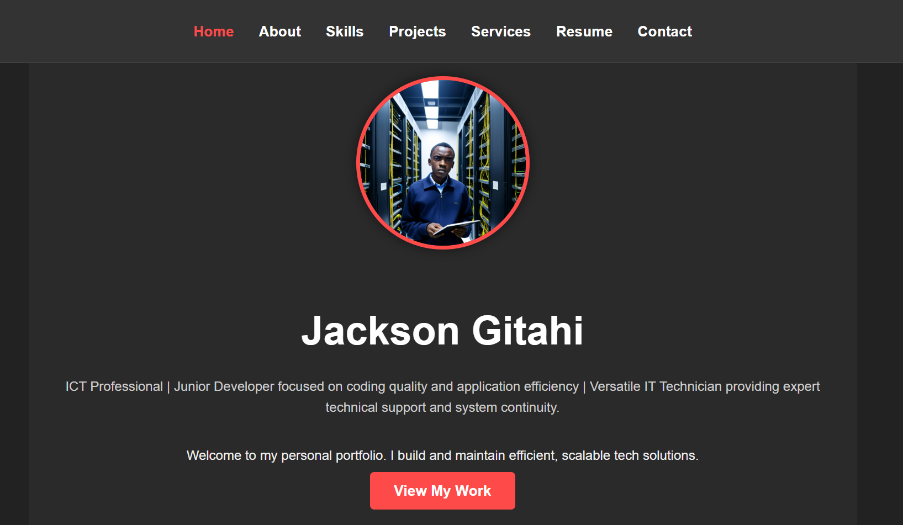

# Jackson Gitahi's Personal Portfolio

This repository contains the source code for my personal portfolio website. It is a clean, responsive, multi-page static site built with HTML and CSS to showcase my skills, projects, and professional experience as an ICT Professional and Junior Developer.

### [View Live Demo](https://jackmarley254.github.io/My-Portfolio/)

---

## 📸 Screenshot

*(**Action required:** Take a screenshot of your site's homepage and add it here. You can upload it to your GitHub repo and link it like this:)*

---

## ✨ Features

* **7-Page Structure:** Includes Home, About, Skills, Projects, Services, Resume, and Contact.
* **Fully Responsive Design:** Adapts seamlessly to all screen sizes, from small mobile phones to large desktops, using CSS Media Queries.
* **Modern Dark Theme:** A professional design based on a dark grey, white, and red accent color scheme.
* **Functional Contact Form:** Integrated with **[Formspree](https://formspree.io/f/xgvrwolw)** to receive email submissions directly from the site without requiring a backend.
* **Optimized Assets:** Clean and well-commented HTML and CSS.

---

## 💻 Technologies Used

* **HTML5:** For the core structure and content.
* **CSS3:** For all styling, layout (Flexbox/Grid), and responsiveness (Media Queries).
* **[Formspree](https://formspree.io):** For the contact form service.
* **[Font Awesome](https://fontawesome.com):** For social media icons in the footer.

---

## 📂 Project Structure

Here is the file structure for the project: